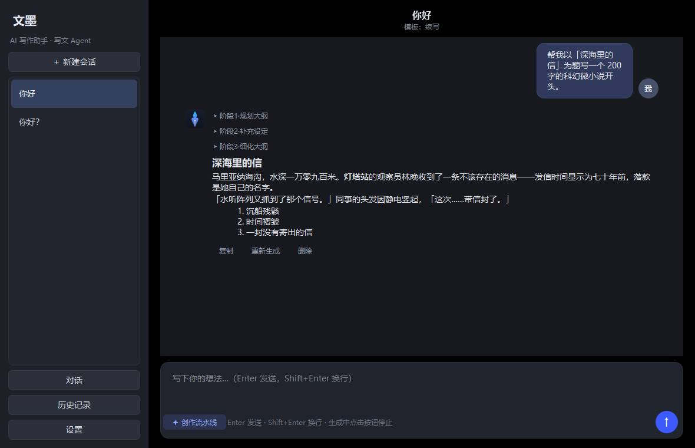
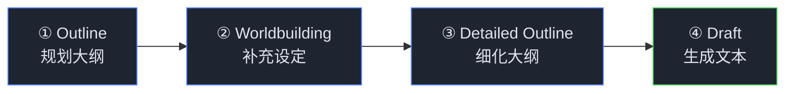

<div align="center">

# 文墨 · WenMo

**A local-first AI writing assistant for Windows**

DeepSeek-style chat UI · Four-stage creative pipeline · SQLite persistence · Bring your own key

[](https://www.python.org/)
[-41CD52?logo=qt&logoColor=white)](https://doc.qt.io/qtforpython/)
[](#)
[](#)
[](LICENSE)

**English** · [简体中文](README.zh-CN.md)



</div>

---

WenMo (文墨, "ink & pen") is not a generic chatbot — it is a **writing agent**. Instead of answering in one shot, it plans an outline, fills in the worldbuilding, refines the outline, and only then writes the final draft. Everything runs locally: your chat history lives in a local SQLite file, and your API key never leaves the Windows Credential Manager.

## ✨ Features

| | Feature | What you get |
|---|---|---|
| 🪄 | **Creative Pipeline** | Every request runs four stages — ① Outline → ② Worldbuilding → ③ Detailed Outline → ④ Draft. Each stage is a collapsible block above the reply; toggle the pipeline off for fast single-shot generation. |
| 💬 | **DeepSeek-style chat UI** | Centered reading column, avatars, collapsible "deep thinking" blocks, per-message action bar (copy / regenerate / delete), streaming typewriter output with a stop button that keeps partial results. |
| 💾 | **Local-first persistence** | All sessions and messages in SQLite (`%APPDATA%\文墨\wenmo.db`), including reasoning traces. Survives restarts; searchable; exportable to Markdown / plain text. |
| 🔐 | **Key stays secret** | API key stored via Windows Credential Manager (DPAPI). The UI only ever shows the last 4 digits. No key ships with the source. |
| 🧩 | **Writing templates** | 7 built-in system prompts (outline, continuation, polish, naming, worldbuilding, style mimicry, free chat). Drop your own JSON files to add more. |
| 🔌 | **OpenAI-compatible** | Presets for DeepSeek / Zhipu GLM / Kimi / Qwen, or point it at any OpenAI-compatible endpoint. One-click "test connection". |
| 📎 | **Context control** | Cap the conversation context to the last N rounds; oldest rounds are truncated automatically. |

## 🪄 The Creative Pipeline



Stages ①–③ are shown as collapsed blocks you can expand to inspect (and they are persisted with the message). Stage ④ is the actual reply. Expect roughly 30–80 s per pipeline run versus 2–10 s in single-shot mode — and ~3–4× the token usage.

## 🚀 Getting Started

1. Grab `文墨.exe` from the latest build (or [build it yourself](#%EF%B8%8F-build-from-source)) and double-click — no Python required.
2. On first launch, open **设置 (Settings)** and paste your own API key. The app ships with **no key built in**.
3. Pick a template, create a session, and start writing.

> App data (database, templates, exports) lives in `%APPDATA%\文墨\`, separate from the exe — upgrades never wipe your history.

## 🛠️ Build from Source

```powershell
cd app
python -m venv venv
venv\Scripts\python -m pip install -r requirements.txt

# run in dev mode
venv\Scripts\python main.py

# run the smoke tests (real API cases are skipped unless a key is configured)
venv\Scripts\python tests\smoke_test.py

# build a single-file exe (with the app icon baked in)
venv\Scripts\python -m PyInstaller --onefile --noconsole --name 文墨 `
    --icon assets\icon.ico --add-data "assets;assets" `
    --hidden-import keyring.backends.Windows main.py
# → app\dist\文墨.exe
```

For an English-named binary, change `--name 文墨` to `--name WenMo`.

## 📝 Custom Templates

Each template is one JSON file in `%APPDATA%\文墨\prompts\`:

```json
{
  "id": "my-template",
  "name": "My Template",
  "system": "You are a ... (system prompt)"
}
```

Restart the app and it shows up in the **new session** dialog.

## 🗂 Project Structure

```
app/
├── main.py                  # entry point + crash logging
├── core/
│   ├── config.py            # data dirs / defaults / provider presets (no secrets)
│   ├── db.py                # SQLite: sessions / messages / settings
│   ├── settings_store.py    # config access + keyring
│   ├── llm.py               # httpx SSE streaming on a QThread
│   ├── pipeline.py          # four-stage creative pipeline
│   ├── exporter.py          # Markdown / TXT export
│   └── prompts_store.py     # writing templates
├── ui/
│   ├── main_window.py       # main window, session list, chat controller
│   ├── chat_widgets.py      # message bubbles, stage blocks, action bar
│   ├── history_page.py      # history & global search
│   ├── settings_dialog.py   # settings dialog
│   └── theme.py             # dark QSS theme
└── tests/
    ├── smoke_test.py        # 7-section regression (DB / templates / real API / pipeline)
    └── ui_preview.py        # offline visual check with fake messages
```

## 🏗 Architecture

See [TECHNICAL.md](TECHNICAL.md) for the full write-up: layer diagram, SQLite schema, streaming parser, pipeline design, packaging notes, and known risks.

## 🔒 Privacy

- Chat data never leaves your machine except in requests to the LLM provider you configure.
- The API key is stored in the Windows Credential Manager and is never written to disk in plain text, logged, or included in exports.

## License

Released under the [MIT License](LICENSE).

---

<div align="center">

Made with 🖋️ by [Forisinger](https://github.com/Forisinger)

</div>
